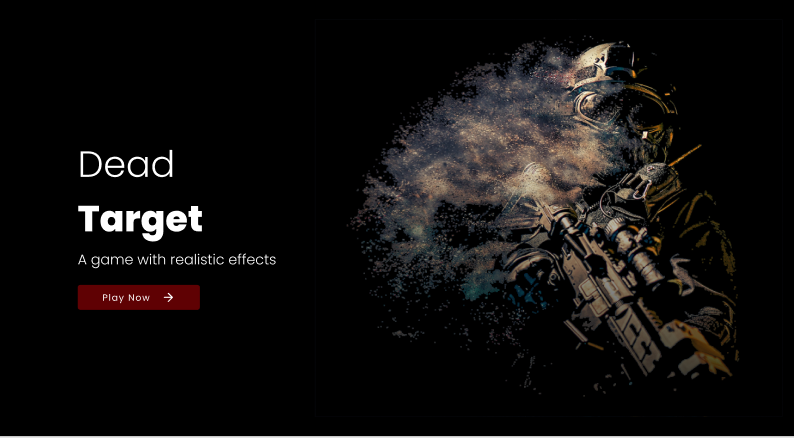
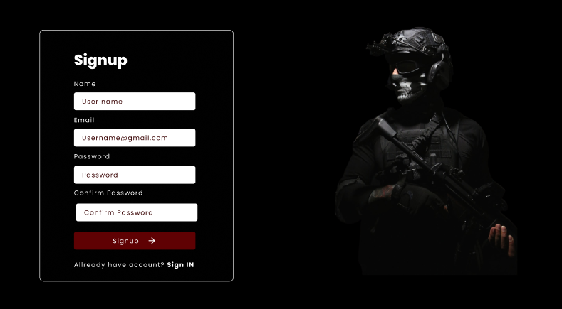
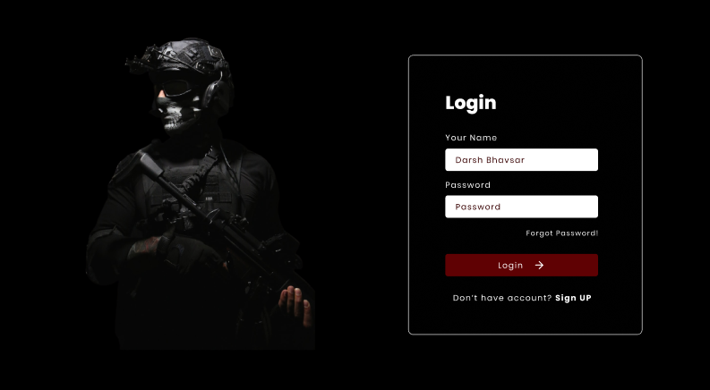
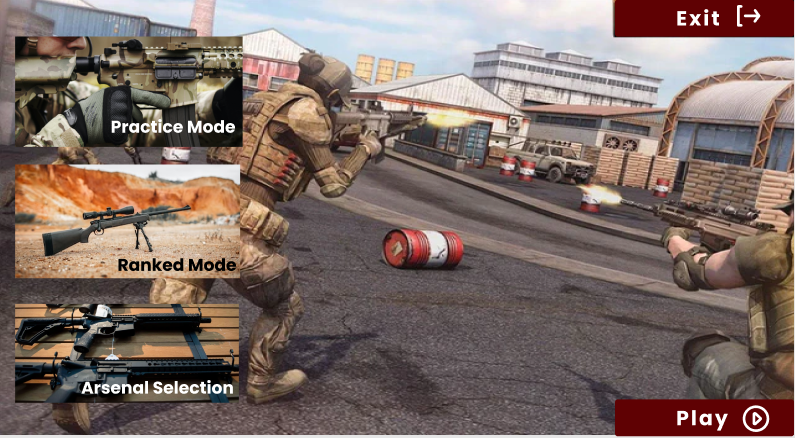
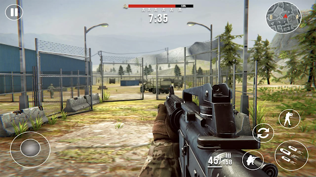

# Dead-Target

## Introduction
Dead Target is a game that reduces human stress by giving players a pleasure of playing in real world. The player feel *machine and user independence* after playing Dead Target. While playing Dead Target, Player can be able to control each and everything by himself. Every action performed by user will have reaction according to his own will. It proves to be exceptional in uplifting player’s mood and repelling his dullness. It instantly takes them to a new world, and their minds will forget disturbing events for the time being. Dead Target has high-definition graphics and images. Quality Animations and realistic effects makes it highly naturalistic. It can also be played using *VR box*.

## Objectives
Followings are the main objectives of Dead Target:
- Enables players to play with realistic effects.
- Reduces user and machine dependency.
- Enable users to control everything by himself.
- Increases user’s interest by high-definition graphics.

## Vision Statement
For users who want to refresh their minds from the stress of life, *Dead Target* is a Web and mobile based game that helps users to lower their level of stress and assist them in combating several serious health issues. Unlike the current games, user doesn't have to restrict themselves for the games rather they can do whatever they want by themselves. It provides high quality animations, graphics, and images to feel users if they are playing in real world.

# Mockups
## Web Mockups

## Mobile Mockups
 
 

### Developer
- <a href="https://daoudhussain.tech/"> Daoud Hussain </a>

 **💬 All the project is fully Open-Sourced. Show some love by giving it a STAR🌟.**